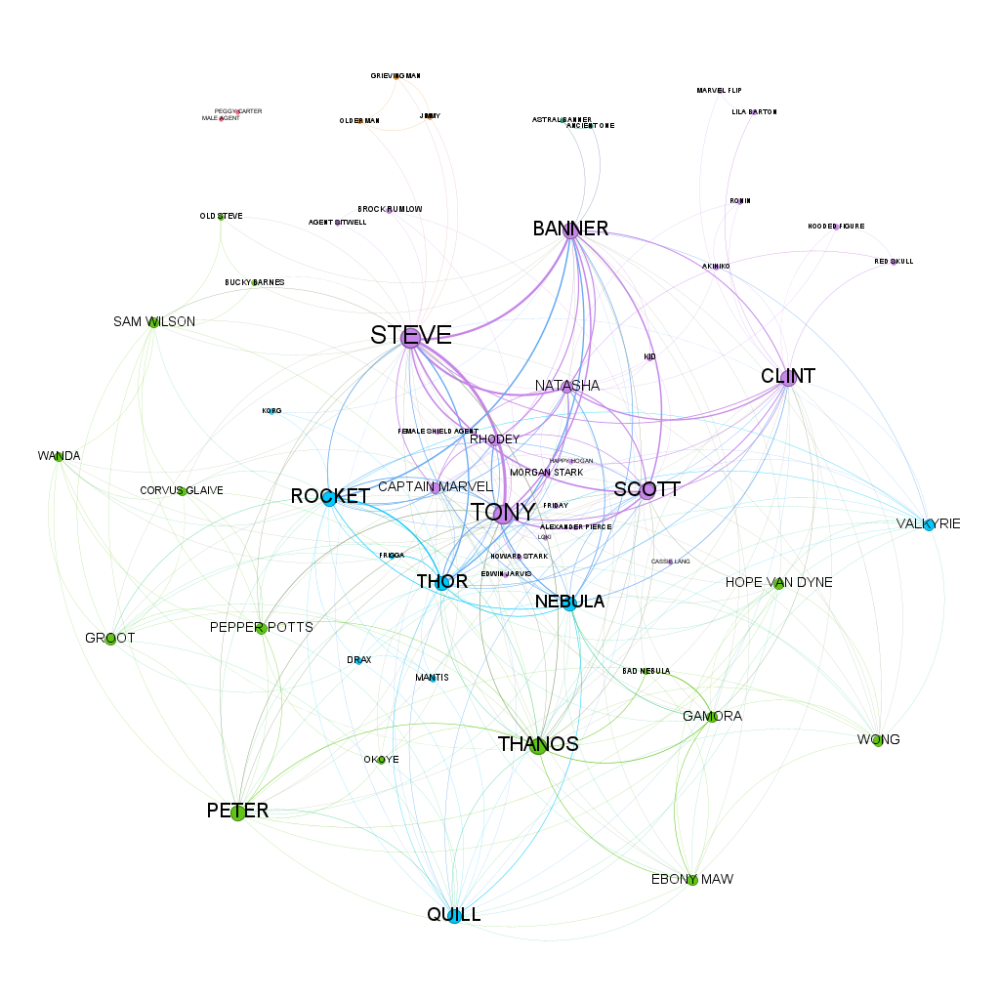

# 🎬 Análise de Rede Social: Avengers: Endgame

Este projeto utiliza técnicas de **Análise de Redes Sociais (SNA)** e programação em **Python** para mapear e analisar as interações entre os personagens no roteiro do filme _Avengers: Endgame_.

## 📌 Sobre o Projeto

O objetivo é transformar um roteiro cinematográfico bruto em uma estrutura de dados matemática (grafo), onde:

- **Nós (Nodes):** Representam os personagens.
- **Arestas (Edges):** Representam uma interação (presença na mesma cena).
- **Peso (Weight):** Representa a frequência de interações entre dois personagens.

## 🛠️ Metodologia e Tecnologias

1.  **Coleta de Dados:** O roteiro original foi processado em formato `.txt`.
2.  **Tratamento (Python):** Uso de **Expressões Regulares (Regex)** para identificar nomes de personagens antes dos diálogos.
    - Criação de um dicionário de sinônimos para unificar variações (ex: _Smart Hulk_ e _Bruce Banner_ -> _Banner_).
    - Segmentação por blocos de cena (`INT.` e `EXT.`).
3.  **Análise de Rede:** Os dados foram exportados em formato `.csv` para visualização e cálculo de métricas de centralidade.

## 📊 Análise dos Resultados

Com base na tabela gerada, observamos os seguintes padrões:

### Visualização do Grafo
Aqui está a representação visual da rede de personagens gerada no Gephi:



### Principais Métricas:

- **Centralidade de Grau:** **Steve Rogers** e **Tony Stark** possuem o maior número de conexões, confirmando o papel de liderança na narrativa.
- **Pontes de Conexão:** **Scott Lang (Ant-Man)** atua como uma "ponte" fundamental entre o núcleo da Terra e a solução científica da viagem no tempo.
- **Densidade de Batalha:** A rede torna-se extremamente densa no ato final, onde múltiplos personagens interagem com o nó central de antagonismo (**Thanos**).

## 🚀 Como Executar

1. Clone o repositório:
   ```bash
   git clone https://github.com/saviosoaresUFC/Analise_da_Rede-Vingadores_Ultimato.git
   ```
2. Navegue até o diretório do projeto:
   ```bash
   cd Analise_da_Rede-Vingadores_Ultimato
   ```
3. Certifique-se de ter o Python instalado.
4. Execute o script principal:
   ```bash
   python main.py
   ```
5. Importe o arquivo rede_vingadores_final.csv no Gephi para visualização.   

## 👥 Autores
- Sávio Carvalho e Francisco Samuel - Desenvolvimento e Análise.
